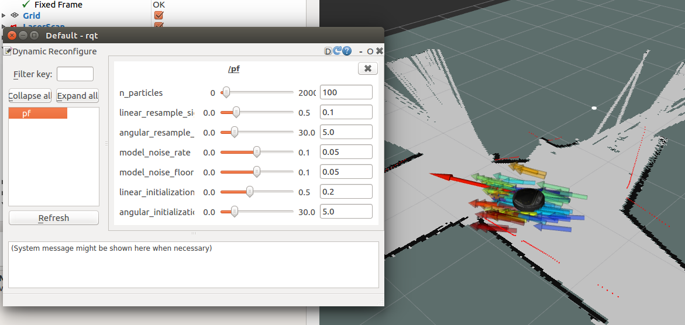

#Robot Localization Project
Riley Chapman and Bonnie Ishiguro  
Computational Robotics 2017, Olin College of Engineering 

##Goal

The goal of this project is to allow the robot to accurately guess its position within a mapped environment using its laser scanner and a particle filter.

##Approach

We first initialize a certain number of particles in a Gaussian distribution around a given pose position on the map.

If the robot then moves a significant amount in its environment, we update the position of each of the particles as if it had moved forward the same distance.  We also add noise to the final position of each particle in a Gaussian distribution.

At each laser scan update, we weight each of the particles based on how well the laser scan data matches its position and orientation.  For each particle, we loop through the laser scan data in increments of 5 degrees, project the laser scan point from the particle, and determine the closest obstacle on the map to that point. Given this distance from the projected point to the closest obstacle, we determined the likelihood that the given particle represents the robot’s pose on the map, using a normal distribution. Each laser scan point used produces a likelihood, and these likelihoods are summed together to produce a total weight value for the given particle. After all the particle weights are determined, they are normalized to add up to 1. 

We next determine the best guess for the robot pose by computing a weighted average of particle position and orientation based on particle weight. 

To resample the particles, we randomly select a fraction of them, with higher weight particles being more likely to be chosen. We then fill out the rest of the particle cloud by duplicating the sampled particles, adding a bit of Gaussian noise. 

To make tuning the particle filter an easier process, we added the ability to dynamically reconfigure certain useful parameters. We set up dynamic reconfiguration for:
- Number of particles
- Standard deviation of Gaussian noise used in the resampling of particles (for both position and orientation)
- Standard deviation of sensor model noise
- Sensor model level of tolerance to imperfections in the map
- Standard deviation of Gaussian noise used to initialize the particle cloud (for both position and orientation)
 
##Design Decisions

We ran into an issue in which our code ran slower than the rate of data coming at it. We needed to make adjustments so that it did not drift away from real time. The main culprit of our speed problems was the nested for loop that weighted the particles based on a laser scan. One quick adjustment that we made was to only look at every 5th laser scan detection. In theory, this made the inner for loop run 5 times faster, but sacrifices some accuracy in the weighting of the particles. We also decided to push as much of our weighting math outside the for loop as possible. Instead of creating a normal distribution and calculating its probability distribution function each time through the loop, we created the normal distribution outside the loop. When that wasn’t fast enough, we used an approximation of the normal distribution that could be quickly calculated inside the loop. 

We decided to use a normal distribution for our sensor model, so that the particles which more closely matched the laser scan data had the higher weights.

We also chose to use a Gaussian distribution wherever we added noise to the position and orientation of newly-initialized or resample particles.

##Challenges

One challenge that we faced was figuring out how to effectively visualize the weights of the particles.  Without knowing the relative weights of our particles, it was difficult to debug our sensor model efficiently.  After realizing that individual arrows within PoseArrays cannot be customized, we learned how to use a matplotlib colormap to color the particles based on their weights.

##Future Work

Our calculated robot pose drifts from the actual pose especially while turning corners, and we would like to experiment with more tuning to improve our particle filter’s performance.

##Lessons

Double check your trig.

